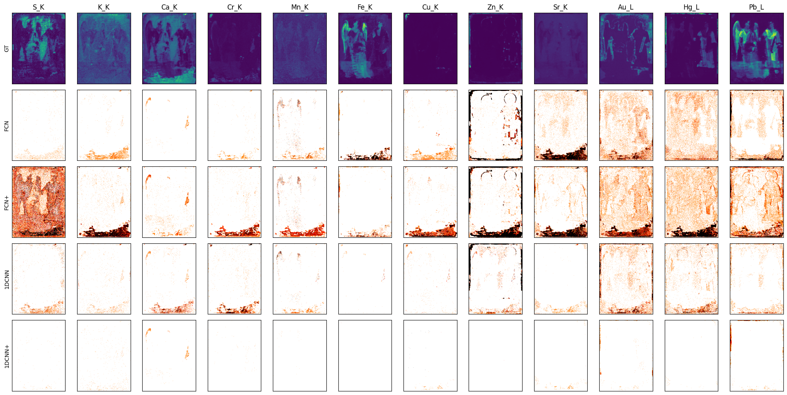

# Elemental Distribution Mapping with Deep Learning Methods

### Evaluation results for Painting 4:

1DCNN+ which incorporate Physics-based prior knowledge outperforms all the other networks.

Figures depict the absolute z-score values spatial distribution for Paintings 4 and 5.

Painting 4

Painting 5

