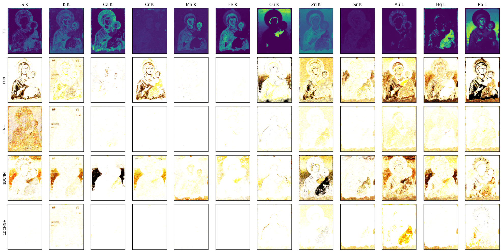

# Elemental Distribution Mapping with Deep Learning Methods

## Evaluation Results for Painting 4

**1DCNN+**, which incorporates physics-based prior knowledge, outperforms all other networks.

*Figures depict the absolute z-score values spatial distribution for Paintings 4 and 5.*

### Painting 4

### Painting 5

